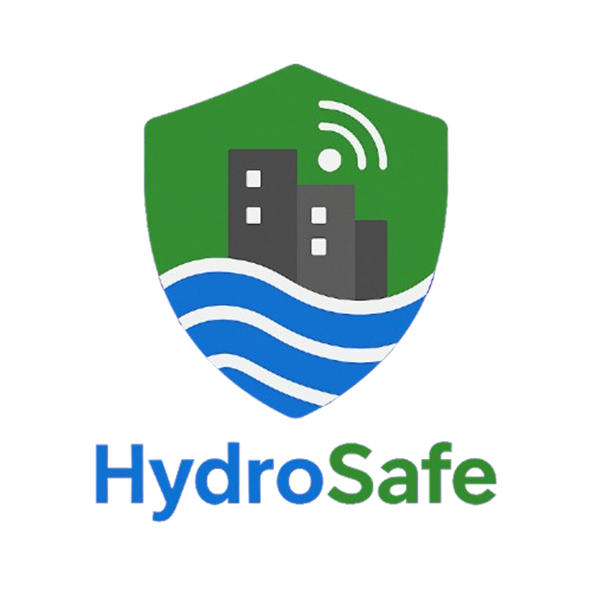
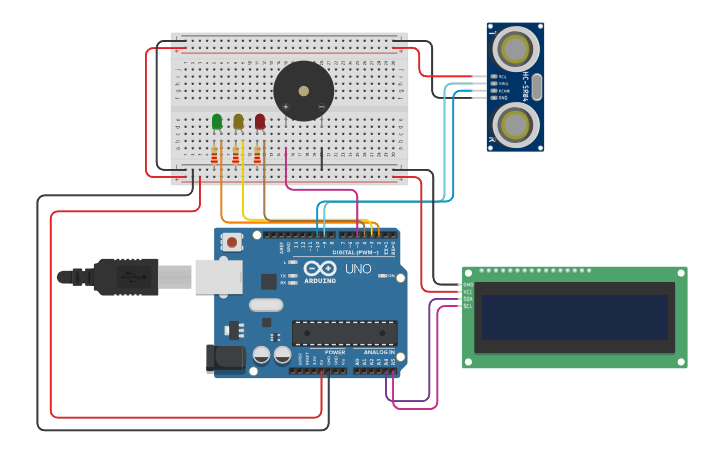

# 🌊 Sistema de Detecção e Alerta de Enchentes com Arduino da HydroSafe

## 📌 Descrição do Problema

As enchentes são fenômenos naturais agravados por ocupações irregulares, impermeabilização do solo e falhas em drenagem urbana. Elas representam risco à vida, perdas materiais e impactos sociais severos. Em muitas comunidades, não há sistemas de monitoramento ou alerta acessíveis e de baixo custo que informem a população sobre o risco iminente de enchentes.

---

## 👥 Equipe

| Nome                           | RM       |
|--------------------------------|----------|
| Eduardo Viudes Chorro          | 564075   |
| Victor Tadashi Saito Barra     | 563582   |
| Frederico de Paula Dias        | 562109   |

---

## ✅ Visão Geral da Solução

Este projeto propõe um **sistema simples, acessível e eficaz** usando **Arduino** para **monitorar o nível da água** e emitir **alertas visuais e sonoros** com base na proximidade da água. Ele também prevê a tendência da situação, informando se está melhorando ou piorando.

### 🔧 Componentes Utilizados:

- Arduino UNO
- Sensor ultrassônico HC-SR04
- LCD I2C 16x2
- LEDs (Verde, Amarelo, Vermelho)
- Buzzer ativo
- Protoboard e jumpers
- Fonte 5V

### ⚙️ Funcionalidades:

| Distância da Água | LED Ativo | Buzzer | Mensagem LCD              | Tendência Monitorada |
|-------------------|-----------|--------|----------------------------|------------------------|
| > 150 cm          | Verde     | Desligado | "Nível seguro"             | Sim                   |
| 75 - 150 cm       | Amarelo   | Desligado | "Risco moderado"           | Sim                   |
| ≤ 75 cm           | Vermelho  | Ativo (tom agudo intermitente) | "ALERTA ENCHENTE!"  | Sim                   |

> Além disso, o sistema informa no display se a situação está "Melhora notada", "Piorando..." ou "Estável".

---

## 🛠️ Como Simular no Tinkercad

1. Acesse o link do projeto no Tinkercad (abaixo).
2. Clique em “**Iniciar Simulação**”.
3. Ajuste a distância do **Sensor Ultrassônico HC-SR04** manualmente.
4. Observe o comportamento dos LEDs, o LCD e o som do buzzer conforme o nível da água muda.

### 🎯 Protótipo no Tinkercad

[🔗 Clique aqui para acessar o projeto no Tinkercad](https://www.tinkercad.com/things/4MMMy5t0pNT-gs1-hydrosafe) 

---

## 📽️ Vídeo Demonstrativo

Assista à demonstração completa do funcionamento do sistema:

[🎬 Assista no YouTube](https://youtu.be/a_hoRntWEy0)  

---

> Projeto educacional sem fins lucrativos, desenvolvido por estudantes da FIAP.
